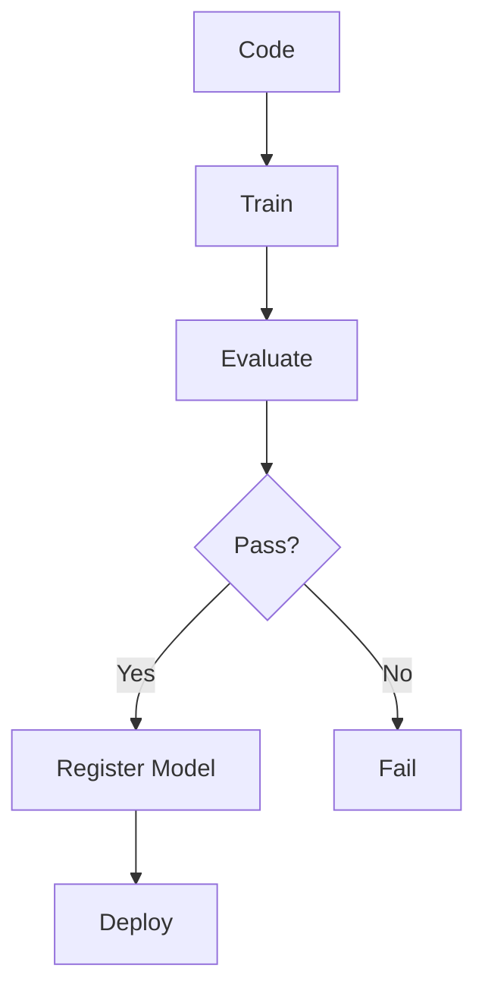
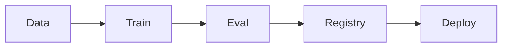

# CI/CD for ML

📄 File: `book/24_ci_cd_gitops/ci_cd_for_ml.md`

This chapter covers **CI/CD for ML**—testing models, versioning, and deployment pipelines.

---

## Study Plan (2–3 days)

* Day 1: ML pipeline stages
* Day 2: Testing + validation
* Day 3: Deployment patterns

---

## 1 — ML CI/CD Pipeline



---

## 2 — ML-Specific Stages

| Stage | Purpose |
|-------|---------|
| Data validation | Schema, drift checks |
| Model training | Reproducible run |
| Model evaluation | Metric thresholds |
| Model registry | Version, metadata |
| Deployment | Staging → prod |

---

## 3 — Training + Evaluation (Conceptual)

```python
# CI step: train and evaluate
def train_and_evaluate():
    """Run in CI; fail if metrics below threshold."""
    model = train(data_path="s3://bucket/train.parquet")
    metrics = evaluate(model, "s3://bucket/test.parquet")
    if metrics["accuracy"] < 0.9:
        raise ValueError(f"Accuracy {metrics['accuracy']} below threshold")
    return model, metrics
```

---

## 4 — Model Registry Integration

```python
# After passing evaluation
def register_model(model, metrics, version: str):
    """Register model in MLflow/Weights&Biases."""
    # mlflow.log_model(model, "model")
    # mlflow.log_metrics(metrics)
    # Create model version
    pass
```

---

## 5 — Deployment Gates

```yaml
# Example: deploy only if tests + eval pass
deploy:
  needs: [test, evaluate]
  if: github.ref == 'refs/heads/main'
  steps:
    - run: deploy_to_staging
    - run: run_smoke_tests
    - run: promote_to_prod
```

---

## Diagram — ML Pipeline



---

## Exercises

1. Add a data schema validation step before training.
2. Implement metric threshold check in CI.
3. Design a canary deployment for model updates.

---

## Interview Questions

1. What is different about CI/CD for ML vs traditional apps?
   *Answer*: Data versioning, model artifacts, metric gates, reproducibility of training.

2. How do you prevent bad models from deploying?
   *Answer*: Evaluation step with metric thresholds; gate deployment on pass.

3. Why version models?
   *Answer*: Rollback, audit, A/B testing; traceability from data to model.

---

## Key Takeaways

* ML pipeline: data → train → evaluate → register → deploy.
* Metric gates in CI; fail if below threshold.
* Model registry for versioning and promotion.

---

## Next Chapter

Proceed to: **infra_as_code.md**
