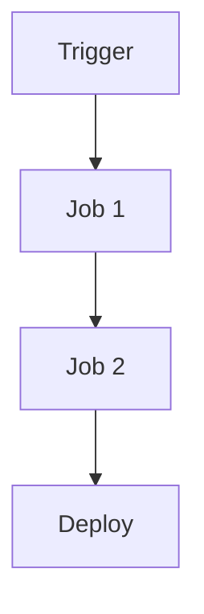
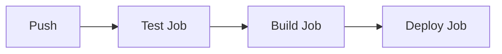

# GitHub Actions Examples

📄 File: `book/24_ci_cd_gitops/github_actions_examples.md`

This chapter covers **GitHub Actions**—CI/CD workflows for testing, building, and deploying.

---

## Study Plan (2 days)

* Day 1: Workflow syntax + jobs
* Day 2: ML/data pipeline examples

---

## 1 — Workflow Structure



---

## 2 — Core Concepts

| Concept | Description |
|---------|-------------|
| Workflow | YAML file in .github/workflows/ |
| Job | Set of steps; runs on same runner |
| Step | Single action (run, use) |
| Action | Reusable unit |

---

## 3 — Minimal Workflow

```yaml
# .github/workflows/test.yml
name: Test
on:
  push:
    branches: [main]
jobs:
  test:
    runs-on: ubuntu-latest
    steps:
      - uses: actions/checkout@v4
      - uses: actions/setup-python@v5
        with:
          python-version: '3.11'
      - run: pip install -r requirements.txt
      - run: pytest
```

---

## 4 — Multi-Job with Caching

```yaml
jobs:
  test:
    runs-on: ubuntu-latest
    steps:
      - uses: actions/checkout@v4
      - uses: actions/cache@v4
        with:
          path: ~/.cache/pip
          key: ${{ runner.os }}-pip-${{ hashFiles('requirements.txt') }}
      - run: pip install -r requirements.txt
      - run: pytest
  build:
    needs: test
    runs-on: ubuntu-latest
    steps:
      - uses: actions/checkout@v4
      - run: docker build -t myimage .
```

---

## 5 — Matrix Build

```yaml
jobs:
  test:
    runs-on: ubuntu-latest
    strategy:
      matrix:
        python-version: ['3.10', '3.11', '3.12']
    steps:
      - uses: actions/checkout@v4
      - uses: actions/setup-python@v5
        with:
          python-version: ${{ matrix.python-version }}
      - run: pytest
```

---

## Diagram — Workflow Run



---

## Exercises

1. Add a lint step (ruff/flake8) before test.
2. Create a workflow that runs on PR only.
3. Use artifacts to pass build output between jobs.

---

## Interview Questions

1. What is the difference between job and step?
   *Answer*: Job = unit of work on one runner; step = single action within job.

2. How do you cache dependencies in GitHub Actions?
   *Answer*: actions/cache with path and key (e.g., hash of lockfile).

3. When to use matrix strategy?
   *Answer*: Test across multiple versions (Python, Node) or platforms in parallel.

---

## Key Takeaways

* Workflows in .github/workflows/; YAML.
* Jobs run in parallel by default; use needs for order.
* Cache for speed; matrix for multi-version testing.

---

## Next Chapter

Proceed to: **argo_cd_flux.md**
