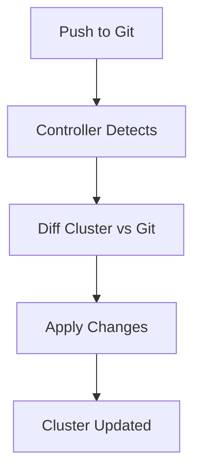
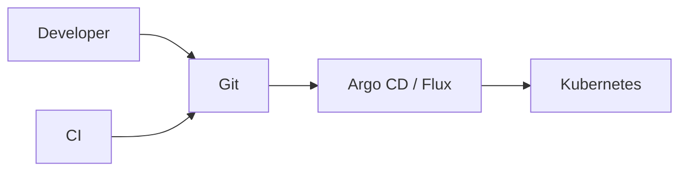

# GitOps Overview

📄 File: `book/24_ci_cd_gitops/gitops_overview.md`

This chapter introduces **GitOps**—using Git as the single source of truth for infrastructure and application deployment.

---

## Study Plan (2 days)

* Day 1: Principles + workflow
* Day 2: Tools + comparison

---

## 1 — What is GitOps?

**GitOps** = Git as source of truth + automated sync to clusters.


---

## 2 — GitOps Principles

| Principle | Description |
|-----------|-------------|
| Declarative | Desired state in Git |
| Automated | Sync pulls from Git |
| Auditable | Git history = change log |
| Continuous | Drift detected and corrected |

### Diagram — GitOps Loop



---

## 3 — Traditional vs GitOps

```python
# Traditional: push from CI
# CI builds image -> kubectl apply -> cluster

# GitOps: pull from Git
# Git has manifests -> Argo/Flux watches -> applies to cluster
# CI only pushes image tag to Git; sync tool does the rest
```

---

## 4 — Benefits

* **Audit**: Every change in Git history
* **Rollback**: `git revert` + sync
* **Security**: No cluster credentials in CI
* **Consistency**: Same process for dev/staging/prod

---

## Diagram — GitOps Flow



---

## Exercises

1. Describe the difference between push-based and pull-based deployment.
2. How would you rollback a bad deployment in GitOps?
3. List 3 benefits of GitOps for compliance.

---

## Interview Questions

1. What is GitOps?
   *Answer*: Git as source of truth; automated sync to cluster; declarative, auditable.

2. Why pull-based (Argo/Flux) over push-based (kubectl from CI)?
   *Answer*: Cluster pulls; no CI credentials to cluster; drift correction; audit in Git.

3. How do you handle secrets in GitOps?
   *Answer*: Don't store in Git; use Sealed Secrets, SOPS, or external secret manager (Vault, AWS Secrets).

---

## Key Takeaways

* Git = source of truth; sync tool applies to cluster.
* Pull-based; declarative; auditable.
* Secrets via external store or encryption.

---

## Next Chapter

Proceed to: **github_actions_examples.md**
