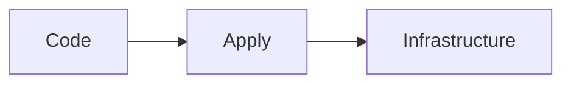
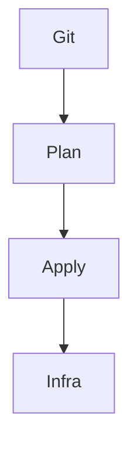
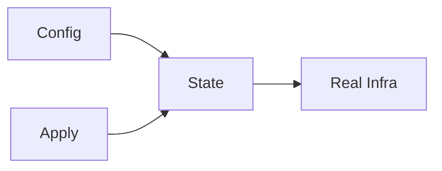

# Infrastructure as Code

📄 File: `book/24_ci_cd_gitops/infra_as_code.md`

This chapter covers **Infrastructure as Code (IaC)**—managing infrastructure via declarative config and version control.

---

## Study Plan (2 days)

* Day 1: Concepts + benefits
* Day 2: Terraform + Pulumi

---

## 1 — IaC Overview



* Define infra in files; apply to create/update
* Version controlled; reproducible

---

## 2 — IaC Benefits

| Benefit | Description |
|---------|-------------|
| Reproducibility | Same config → same infra |
| Versioning | Git history of changes |
| Documentation | Code is the doc |
| Automation | CI/CD for infra |

### Diagram — IaC Flow



---

## 3 — Declarative vs Imperative

```python
# Declarative (Terraform): describe desired state
# resource "aws_s3_bucket" "data" {
#   bucket = "my-data-bucket"
# }

# Imperative (CLI/scripts): describe steps
# aws s3 mb s3://my-data-bucket
```

---

## 4 — Tool Comparison

| Tool | Style | Cloud |
|------|-------|-------|
| Terraform | Declarative, HCL | Multi |
| Pulumi | Imperative, code | Multi |
| CloudFormation | Declarative, YAML/JSON | AWS |
| Bicep | Declarative | Azure |

---

## 5 — State Management

```python
# Terraform state: tracks what exists
# Stored in S3, GCS, or Terraform Cloud
# Critical: lock state to prevent concurrent apply
```

---

## Diagram — State



---

## Exercises

1. Create an S3 bucket with Terraform.
2. Use variables for environment (dev/prod).
3. Add output for bucket name.

---

## Interview Questions

1. What is Infrastructure as Code?
   *Answer*: Define infra in code; version control; apply to create/update; reproducible.

2. Why is Terraform state important?
   *Answer*: Tracks mapping of config to real resources; enables update and destroy; must be consistent.

3. Declarative vs imperative IaC?
   *Answer*: Declarative = desired state; tool figures out how. Imperative = explicit steps.

---

## Key Takeaways

* IaC = infra in code; version control; reproducible.
* Terraform: declarative, HCL, state file.
* State must be shared and locked for teams.

---

## Next Chapter

Proceed to: **terraform_examples.md**
