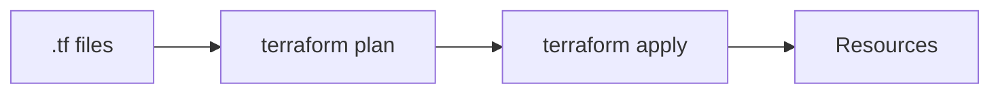
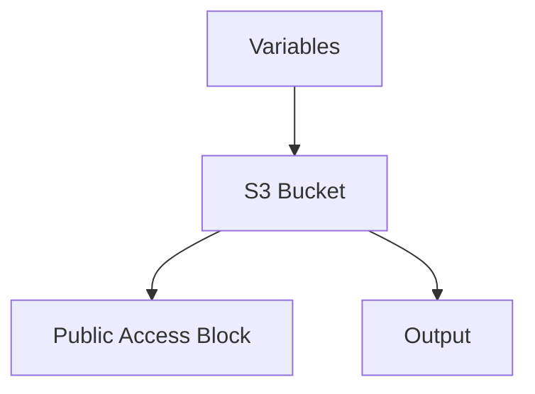

# Terraform Examples

📄 File: `book/24_ci_cd_gitops/terraform_examples.md`

This chapter provides **Terraform examples** for common data/AI infrastructure—S3, EKS, and variables.

---

## Study Plan (2 days)

* Day 1: Basics + S3
* Day 2: Modules + outputs

---

## 1 — Terraform Structure



---

## 2 — Provider + S3 Bucket

```hcl
# main.tf
terraform {
  required_providers {
    aws = {
      source  = "hashicorp/aws"
      version = "~> 5.0"
    }
  }
}

provider "aws" {
  region = var.aws_region
}

# S3 bucket for data lake
resource "aws_s3_bucket" "data_lake" {
  bucket = "${var.project_name}-data-${var.environment}"

  tags = {
    Name        = "Data Lake"
    Environment = var.environment
  }
}

# Block public access
resource "aws_s3_bucket_public_access_block" "data_lake" {
  bucket = aws_s3_bucket.data_lake.id

  block_public_acls       = true
  block_public_policy     = true
  ignore_public_acls      = true
  restrict_public_buckets = true
}
```

---

## 3 — Variables

```hcl
# variables.tf
variable "aws_region" {
  description = "AWS region"
  type        = string
  default     = "us-east-1"
}

variable "project_name" {
  description = "Project name prefix"
  type        = string
}

variable "environment" {
  description = "Environment (dev, staging, prod)"
  type        = string
}
```

---

## 4 — Outputs

```hcl
# outputs.tf
output "bucket_name" {
  description = "Name of the data lake bucket"
  value       = aws_s3_bucket.data_lake.id
}

output "bucket_arn" {
  description = "ARN of the bucket"
  value       = aws_s3_bucket.data_lake.arn
}
```

---

## 5 — Remote State (S3)

```hcl
terraform {
  backend "s3" {
    bucket         = "my-terraform-state"
    key            = "data-lake/terraform.tfstate"
    region         = "us-east-1"
    dynamodb_table = "terraform-locks"
  }
}
```

---

## Diagram — Resource Dependencies



---

## Exercises

1. Add an IAM policy for the bucket.
2. Create a module for reusable S3 + policy.
3. Use workspaces for dev/staging/prod.

---

## Interview Questions

1. What does terraform plan do?
   *Answer*: Shows what would change without applying; preview of create/update/destroy.

2. How do you manage secrets in Terraform?
   *Answer*: Don't put in .tf; use env vars, Vault, or AWS Secrets Manager data source.

3. What is Terraform state drift?
   *Answer*: Real infra differs from state; use terraform refresh; prevent manual changes.

---

## Key Takeaways

* Provider → resources → outputs; variables for config.
* Remote state in S3 + DynamoDB lock.
* Modules for reuse; workspaces for environments.

---

## Next Chapter

Proceed to: **25_feature_stores_dataset_versioning/feature_stores_overview.md**
