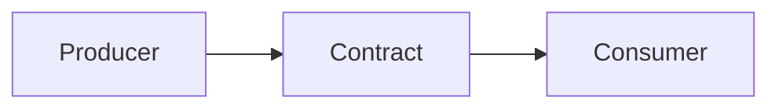
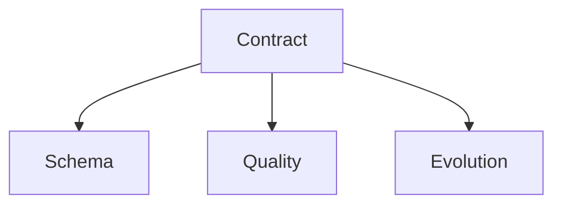
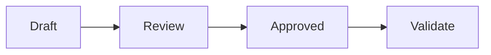

# Data Contracts

📄 File: `book/25_feature_stores_dataset_versioning/data_contracts.md`

This chapter covers **data contracts**—formal agreements on schema, quality, and SLAs between producers and consumers.

---

## Study Plan (2 days)

* Day 1: Concepts + schema
* Day 2: Validation + tooling

---

## 1 — What is a Data Contract?

**Data contract** = agreement on schema, semantics, and quality between producer and consumer.



---

## 2 — Contract Components

| Component | Description |
|-----------|-------------|
| Schema | Columns, types, nullability |
| Semantics | Meaning of fields |
| SLA | Freshness, availability |
| Evolution | Backward compatibility rules |

### Diagram — Contract Layers



---

## 3 — Schema Contract (Example)

```python
from pydantic import BaseModel
from typing import Optional
from datetime import datetime

class UserEvent(BaseModel):
    """Contract for user event data."""
    user_id: str
    event_type: str
    timestamp: datetime
    properties: Optional[dict] = None

    class Config:
        extra = "forbid"  # Reject unknown fields
```

---

## 4 — Validation

```python
def validate_batch(df, contract):
    """Validate DataFrame against contract."""
    for col, dtype in contract.schema.items():
        if col not in df.columns:
            raise ValueError(f"Missing column: {col}")
        if df[col].dtype != dtype:
            raise ValueError(f"Type mismatch for {col}")
    return True
```

---

## 5 — Evolution Rules

```python
# Backward compatible: add optional column, don't remove
# Breaking: remove column, change type
EVOLUTION_RULES = {
    "add_optional": "allowed",
    "remove_column": "breaking",
    "change_type": "breaking",
    "rename_column": "breaking",
}
```

---

## Diagram — Contract Lifecycle



---

## Exercises

1. Define a Pydantic contract for a fact table.
2. Add validation for null rates and value ranges.
3. Document evolution policy for a dataset.

---

## Interview Questions

1. What is a data contract?
   *Answer*: Agreement on schema, semantics, quality; enables trust between producer/consumer.

2. Why use extra="forbid" in Pydantic?
   *Answer*: Reject unknown fields; strict schema; catch producer mistakes early.

3. How do you handle schema evolution?
   *Answer*: Add optional columns; avoid removals; version contracts; communicate breaking changes.

---

## Key Takeaways

* Contract = schema + semantics + SLA + evolution.
* Validate at producer and consumer boundaries.
* Document and enforce evolution rules.

---

## Next Chapter

Proceed to: **dataset_versioning.md**
