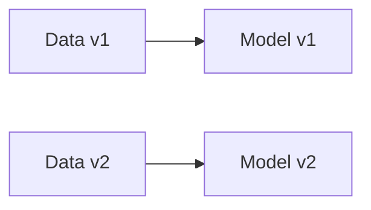
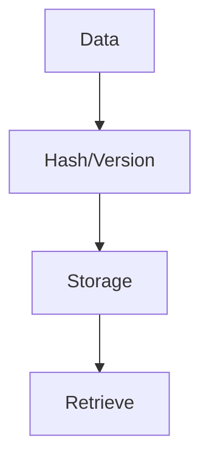
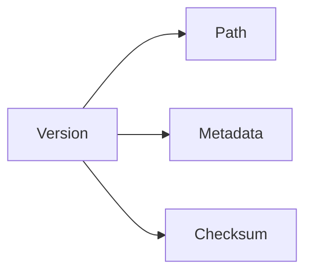

# Dataset Versioning

📄 File: `book/25_feature_stores_dataset_versioning/dataset_versioning.md`

This chapter covers **dataset versioning**—tracking and reproducing data across pipeline runs and experiments.

---

## Study Plan (2 days)

* Day 1: Concepts + strategies
* Day 2: Tools (DVC, LakeFS)

---

## 1 — Why Version Data?



* Reproducibility: same data → same model
* Audit: what data trained this model?

---

## 2 — Versioning Strategies

| Strategy | Description | Tool |
|----------|-------------|------|
| Path-based | v1/, v2/ or date partitions | S3, GCS |
| Hash-based | Content-addressable | DVC |
| Branch-based | Git-like branches | LakeFS |

### Diagram — Version Flow



---

## 3 — Path-Based Versioning

```python
# Version by date or run ID
def get_data_path(version: str) -> str:
    """Get path for dataset version."""
    return f"s3://bucket/datasets/train/{version}/"

# v1, v2, or 2025-01-15
path = get_data_path("2025-01-15")
```

---

## 4 — Content-Addressable (DVC)

```python
# DVC tracks file hash; .dvc file stores hash
# dvc add data/train.parquet
# Creates data/train.parquet.dvc with hash
# Git tracks .dvc; actual data in remote storage
```

---

## 5 — Metadata Tracking

```python
from dataclasses import dataclass
from datetime import datetime

@dataclass
class DatasetVersion:
    """Metadata for a dataset version."""
    version_id: str
    path: str
    created_at: datetime
    schema_version: str
    row_count: int
    checksum: str
```

---

## Diagram — Version Metadata



---

## Exercises

1. Design a path structure for versioned datasets.
2. Add DVC to a project and track a dataset.
3. Implement a version registry (DB or file).

---

## Interview Questions

1. Why version datasets?
   *Answer*: Reproducibility, audit, rollback; trace model to exact data.

2. Path-based vs hash-based versioning?
   *Answer*: Path = simple, human-readable; hash = content-addressable, dedup.

3. How does DVC work with Git?
   *Answer*: DVC stores small .dvc files in Git (with hash); actual data in remote (S3, GCS).

---

## Key Takeaways

* Version data for reproducibility and audit.
* Path, hash, or branch-based strategies.
* Track metadata: schema, row count, checksum.

---

## Next Chapter

Proceed to: **dvc.md**
