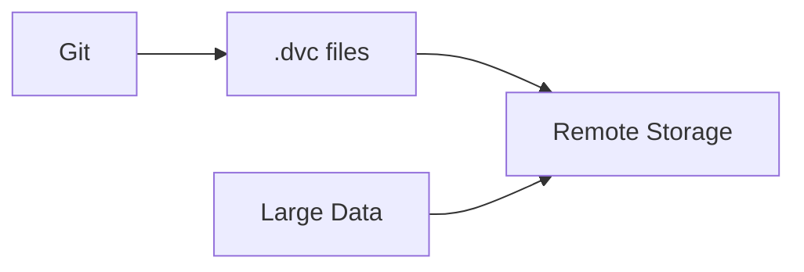
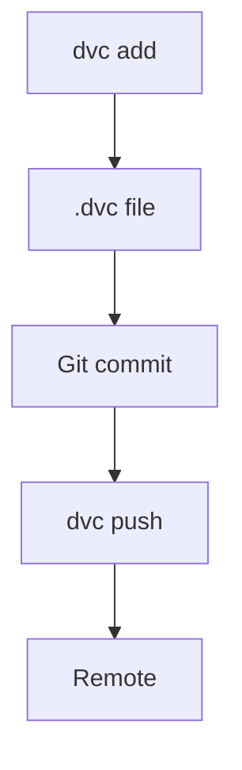

# DVC

📄 File: `book/25_feature_stores_dataset_versioning/dvc.md`

This chapter covers **DVC (Data Version Control)**—versioning data and models with Git-like workflows.

---

## Study Plan (2 days)

* Day 1: Basics + add/push
* Day 2: Pipelines + experiments

---

## 1 — DVC Overview



* Git for code; DVC for data/models
* .dvc files store pointers (hash); data in remote

---

## 2 — Core Commands

| Command | Purpose |
|---------|---------|
| dvc add | Track file/dir; create .dvc |
| dvc push | Upload to remote |
| dvc pull | Download from remote |
| dvc status | Check sync state |

---

## 3 — Setup + Add

```bash
# Initialize DVC
dvc init

# Add remote (S3 example)
dvc remote add -d storage s3://my-bucket/dvc

# Track dataset
dvc add data/train.parquet
# Creates data/train.parquet.dvc
# Git add data/train.parquet.dvc (not the parquet)

# Push to remote
dvc push
```

---

## 4 — DVC Pipeline

```yaml
# dvc.yaml
stages:
  prepare:
    cmd: python scripts/prepare.py
    deps:
      - data/raw
    outs:
      - data/prepared
  train:
    cmd: python scripts/train.py
    deps:
      - data/prepared
    outs:
      - model.pkl
```

```bash
# Run pipeline
dvc repro

# Track pipeline outputs
dvc add model.pkl
```

---

## 5 — Python API

```python
from dvc.repo import Repo

repo = Repo(".")
# Get path for tracked file
path = repo.get_url("data/train.parquet")
# Or use dvc.api.open()
import dvc.api
with dvc.api.open("data/train.parquet", repo=".") as f:
    df = pd.read_parquet(f)
```

---

## Diagram — DVC Flow



---

## Exercises

1. Add a dataset and push to S3.
2. Create a dvc.yaml pipeline with 2 stages.
3. Use dvc.api to load data in a script.

---

## Interview Questions

1. What does dvc add do?
   *Answer*: Computes hash, creates .dvc file, adds to .gitignore; Git tracks .dvc, not data.

2. How does DVC handle large files?
   *Answer*: Stores in remote (S3, GCS); only hash/pointer in repo; lazy pull.

3. What is dvc repro?
   *Answer*: Re runs pipeline; skips stages whose deps/outputs unchanged (like make).

---

## Key Takeaways

* DVC = Git for data; .dvc files + remote storage.
* dvc add, push, pull; repro for pipelines.
* Use with Git; .dvc in Git, data in remote.

---

## Next Chapter

Proceed to: **lakefs.md**
