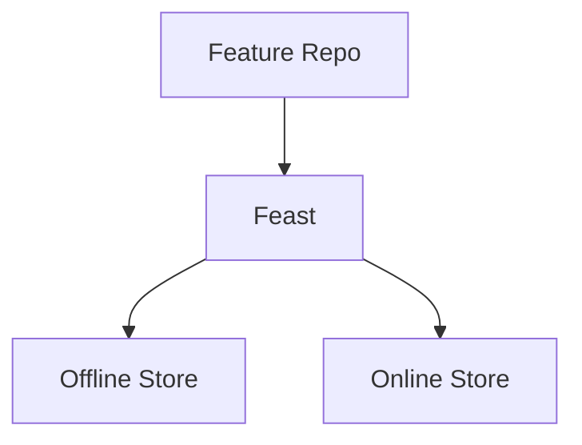
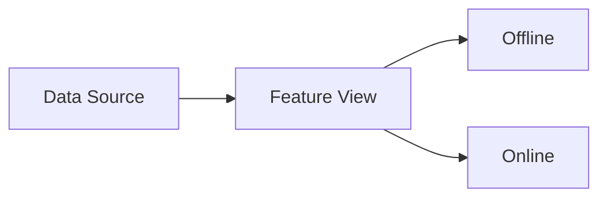

# Feast

📄 File: `book/25_feature_stores_dataset_versioning/feast.md`

This chapter covers **Feast**—open source feature store for defining, storing, and serving ML features.

---

## Study Plan (2–3 days)

* Day 1: Entities + features
* Day 2: Offline + online
* Day 3: Deployment

---

## 1 — Feast Architecture



---

## 2 — Core Concepts

| Concept | Description |
|---------|-------------|
| Entity | Primary key (user_id, item_id) |
| Feature View | Set of features + source |
| Feature Service | Grouping for serving |

---

## 3 — Feature Definition (YAML)

```yaml
# feature_repo/feature_store.yaml
project: my_project
registry: s3://bucket/registry.db
provider: local
online_store:
  type: redis
```

---

## 4 — Entity + Feature View

```python
# feature_repo/definitions.py
from feast import Entity, FeatureView, Field, FileSource
from feast.types import Float32, Int64
from datetime import timedelta

# Entity: what we're describing
user = Entity(name="user_id", join_keys=["user_id"])

# Feature view: features + source
user_features = FeatureView(
    name="user_features",
    entities=[user],
    schema=[
        Field(name="avg_order_value", dtype=Float32),
        Field(name="order_count_30d", dtype=Int64),
    ],
    source=FileSource(
        path="s3://bucket/features/user.parquet",
        timestamp_field="event_timestamp",
    ),
    ttl=timedelta(days=1),
)
```

---

## 5 — Retrieval

```python
from feast import FeatureStore

store = FeatureStore(repo_path="feature_repo")

# Offline: for training
entity_df = ...  # DataFrame with user_id, event_timestamp
training_df = store.get_historical_features(
    entity_df=entity_df,
    features=["user_features:avg_order_value", "user_features:order_count_30d"],
).to_df()

# Online: for inference
online_features = store.get_online_features(
    features=["user_features:avg_order_value"],
    entity_rows=[{"user_id": "123"}],
).to_dict()
```

---

## Diagram — Feast Flow



---

## Exercises

1. Define an entity and feature view for item features.
2. Retrieve historical features for a training set.
3. Serve online features for a single user.

---

## Interview Questions

1. What is a Feast Feature View?
   *Answer*: Definition of features + source; schema, TTL, and entity links.

2. How does Feast ensure point-in-time correctness?
   *Answer*: Uses event_timestamp; joins features as of that time for historical retrieval.

3. What online stores does Feast support?
   *Answer*: Redis, DynamoDB, SQLite (dev); configurable per deployment.

---

## Key Takeaways

* Entity + Feature View + Source; TTL for freshness.
* get_historical_features for training; get_online_features for inference.
* Registry stores definitions; supports Git-based workflow.

---

## Next Chapter

Proceed to: **tecton.md**
