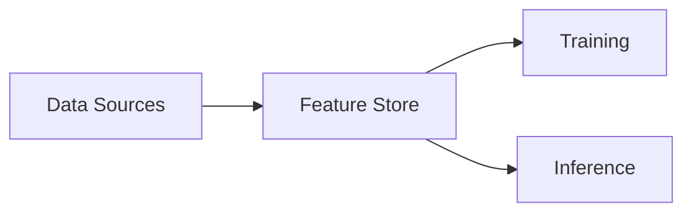
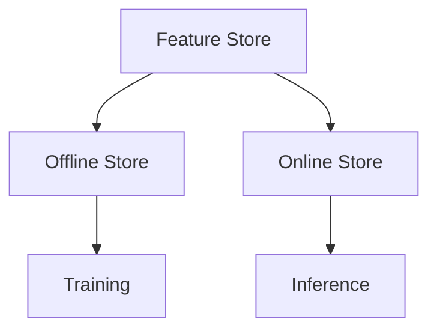
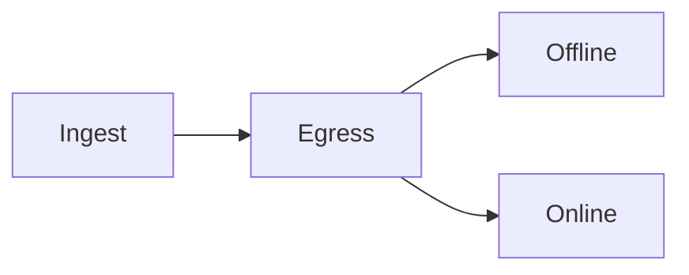

# Feature Stores Overview

📄 File: `book/25_feature_stores_dataset_versioning/feature_stores_overview.md`

This chapter introduces **feature stores**—centralized storage and serving of ML features for training and inference.

---

## Study Plan (2–3 days)

* Day 1: Concepts + use cases
* Day 2: Offline vs online
* Day 3: Tool comparison

---

## 1 — What is a Feature Store?

**Feature store** = storage + serving layer for ML features; enables reuse and consistency.



---

## 2 — Core Concepts

| Concept | Description |
|---------|-------------|
| Feature | Input to model (e.g., user_avg_order_value) |
| Entity | Key for lookup (e.g., user_id) |
| Offline store | Batch features for training |
| Online store | Low-latency for inference |

### Diagram — Feature Store Architecture



---

## 3 — Offline vs Online

```python
# Offline: historical features for training
# Stored in Parquet/Delta; point-in-time correct
# Example: user features as of 2025-01-01 for training

# Online: latest features for inference
# Stored in Redis/DynamoDB; low latency
# Example: user's current avg_order_value for real-time prediction
```

---

## 4 — Point-in-Time Correctness

```python
# Training must use features as they were at prediction time
# Not as they are now (would leak future info)
def get_training_features(entity_ids, event_timestamps):
    """
    For each (entity, timestamp), return features
    as of that timestamp (no future data).
    """
    pass
```

---

## 5 — Tool Landscape

| Tool | Focus | Offline | Online |
|------|-------|---------|--------|
| Feast | OSS, flexible | Parquet, BigQuery | Redis, DynamoDB |
| Tecton | Managed | Snowflake, etc. | Redis, DynamoDB |
| Databricks | Unified | Delta | Redis |

---

## Diagram — Feature Flow



---

## Exercises

1. Design features for a recommendation model.
2. Explain point-in-time correctness with an example.
3. When would you use offline-only vs both stores?

---

## Interview Questions

1. What is a feature store?
   *Answer*: Centralized storage and serving of features; consistency between training and inference.

2. Why separate offline and online stores?
   *Answer*: Offline = batch, historical, cheap; online = low latency, latest values.

3. What is point-in-time correctness?
   *Answer*: Training features must reflect state at prediction time; no future leakage.

---

## Key Takeaways

* Feature store = reuse + consistency across training/inference.
* Offline for training; online for real-time inference.
* Point-in-time correctness is critical.

---

## Next Chapter

Proceed to: **feast.md**
