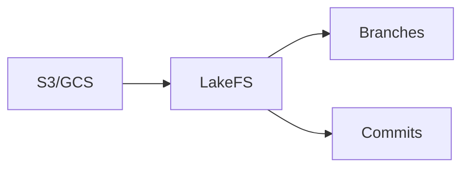
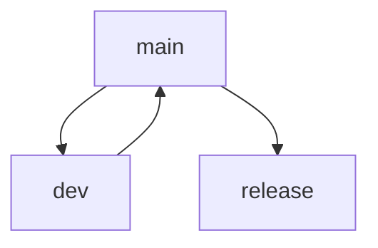

# LakeFS

📄 File: `book/25_feature_stores_dataset_versioning/lakefs.md`

This chapter covers **LakeFS**—Git-like versioning for object storage (S3, GCS) with branches and commits.

---

## Study Plan (2 days)

* Day 1: Concepts + setup
* Day 2: Branches + merges

---

## 1 — LakeFS Overview



* Git-like interface for data lakes
* Branches, commits, merges on object storage

---

## 2 — Core Concepts

| Concept | Description |
|---------|-------------|
| Repository | Top-level container (maps to storage) |
| Branch | Isolated copy (logical, not physical) |
| Commit | Snapshot of branch state |
| Merge | Combine branches |

---

## 3 — Setup (Conceptual)

```python
# LakeFS wraps S3; repository = prefix
# lakefs://repo-name/branch/path
# Example: lakefs://data-lake/main/raw/events.parquet
```

---

## 4 — Branch + Commit Workflow

```bash
# Create branch
lakectl branch create lakefs://repo/dev --source main

# Copy/upload to branch
lakectl fs upload lakefs://repo/dev/raw/events.parquet -s local.parquet

# Commit
lakectl commit lakefs://repo/dev -m "Add events data"

# Merge to main
lakectl merge lakefs://repo/dev lakefs://repo/main
```

---

## 5 — Python Client

```python
import lakefs_client
from lakefs_client import models

# Connect and list branches
client = lakefs_client.ApiClient()
branches_api = lakefs_client.BranchesApi(client)
branches = branches_api.list_branches(repository="repo")
for b in branches:
    print(b.id, b.commit_id)
```

---

## Diagram — Branch Model



---

## Exercises

1. Create a repo and branch; upload a file; commit.
2. Merge dev into main.
3. Use LakeFS with Spark to read from a branch.

---

## Interview Questions

1. What is LakeFS?
   *Answer*: Git-like versioning for object storage; branches, commits, merges on S3/GCS.

2. How does LakeFS avoid copying data on branch?
   *Answer*: Copy-on-write; branches share objects until modified; metadata tracks differences.

3. When to use LakeFS vs DVC?
   *Answer*: LakeFS for data lake, multi-user, branch workflows; DVC for ML project, single-repo data versioning.

---

## Key Takeaways

* LakeFS = Git for data lakes; branches, commits, merges.
* Wraps S3/GCS; copy-on-write efficiency.
* Use for experimentation, rollback, CI/CD on data.

---

## Next Chapter

Proceed to: **26_data_catalogs_governance/data_catalogs.md**
