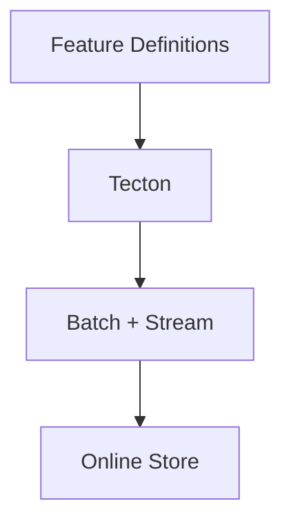
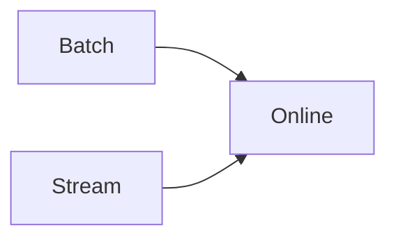

# Tecton

📄 File: `book/25_feature_stores_dataset_versioning/tecton.md`

This chapter covers **Tecton**—managed feature platform with real-time and batch feature computation.

---

## Study Plan (2 days)

* Day 1: Concepts + definitions
* Day 2: Serving + comparison

---

## 1 — Tecton Overview



* Managed service; real-time + batch
* Python/SQL definitions

---

## 2 — Core Concepts

| Concept | Description |
|---------|-------------|
| Feature View | Features + transformation |
| Data Source | Raw input |
| Feature Service | Serving endpoint |

---

## 3 — Feature Definition (Python)

```python
from tecton import batch_feature_view, FilteredSource
from datetime import datetime, timedelta

@batch_feature_view(
    sources=[FilteredSource(orders_source)],
    entities=[user],
    mode="spark",
    batch_schedule=timedelta(days=1),
    ttl=timedelta(days=7),
)
def user_order_metrics(orders):
    """Batch feature view: aggregate order metrics per user."""
    from pyspark.sql import functions as F
    return orders.groupBy("user_id").agg(
        F.avg("amount").alias("avg_order_value"),
        F.count("*").alias("order_count"),
    )
```

---

## 4 — Stream Feature View

```python
@stream_feature_view(
    source=stream_source,
    entities=[user],
    mode="spark_streaming",
    ttl=timedelta(hours=1),
)
def user_recent_orders(stream):
    """Real-time features from stream."""
    return stream.groupBy("user_id").agg(...)
```

---

## 5 — Serving

```python
# Tecton provides API for online serving
# get_features(feature_service, entity_keys)
# Returns latest feature values for inference
```

---

## Diagram — Tecton Pipeline



---

## Exercises

1. Define a batch feature view with Spark.
2. Compare Tecton vs Feast for a use case.
3. Design a feature service for a recommendation model.

---

## Interview Questions

1. Tecton vs Feast?
   *Answer*: Tecton is managed, real-time + batch; Feast is OSS, more flexible, self-hosted.

2. What is a stream feature view?
   *Answer*: Features computed from streaming data; low latency updates for online store.

3. When to use Tecton?
   *Answer*: When you want managed, real-time features and less ops burden.

---

## Key Takeaways

* Tecton: managed; batch + stream; Python/SQL.
* Feature views with batch_schedule or streaming.
* Online serving via Feature Service API.

---

## Next Chapter

Proceed to: **data_contracts.md**
