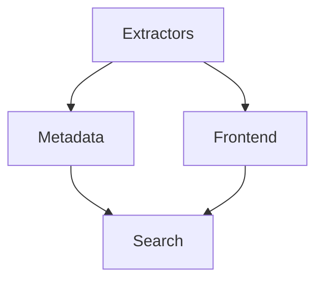
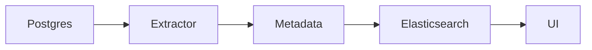

# Amundsen

📄 File: `book/26_data_catalogs_governance/amundsen.md`

This chapter covers **Amundsen**—Lyft's open source data discovery and metadata platform.

---

## Study Plan (2 days)

* Day 1: Architecture + setup
* Day 2: Metadata + search

---

## 1 — Amundsen Architecture



* Metadata service (API)
* Search (Elasticsearch)
* Frontend (React)

---

## 2 — Core Concepts

| Concept | Description |
|---------|-------------|
| Resource | Table, dashboard, user |
| Metadata | Description, tags, owner |
| Lineage | Upstream/downstream |

---

## 3 — Extractor (Python)

```python
# Amundsen extractor: pull metadata from source
from amundsen_databuilder.extractor import postgres_metadata_extractor

# Extractor config
extractor_config = {
    "extractor.postgres_metadata.PostgresMetadataExtractor": {
        "database": "postgres",
        "conn_string": "postgresql://...",
    }
}
# Runs as job; pushes to metadata service
```

---

## 4 — Metadata Model

```python
# Resources: table, column, dashboard
# Table has: name, schema, db, description, tags, owner
# Column has: name, type, description
```

---

## 5 — Search

```python
# Amundsen indexes metadata in Elasticsearch
# Search by: table name, column, tag, description
# API: GET /search?query=user_id
```

---

## Diagram — Amundsen Flow



---

## Exercises

1. Run Amundsen locally with Docker.
2. Add an extractor for a new source (e.g., BigQuery).
3. Search for a table and verify lineage.

---

## Interview Questions

1. What is Amundsen?
   *Answer*: OSS data discovery catalog; metadata + search + lineage; extractors for various sources.

2. How does Amundsen get metadata?
   *Answer*: Extractors pull from sources (Postgres, Hive, etc.); push to metadata service.

3. Amundsen vs DataHub?
   *Answer*: Amundsen lighter, focused on discovery; DataHub broader, more governance features.

---

## Key Takeaways

* Amundsen: discovery + metadata + lineage.
* Extractors for various sources; Elasticsearch for search.
* OSS; self-hosted; Lyft-originated.

---

## Next Chapter

Proceed to: **datahub.md**
