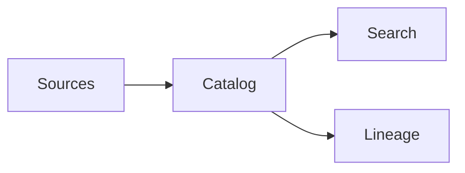
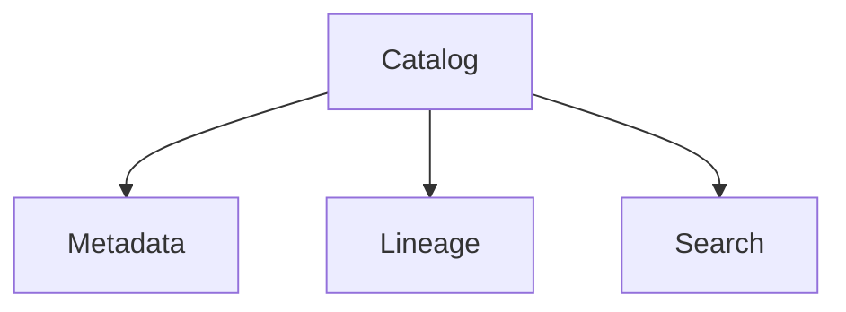
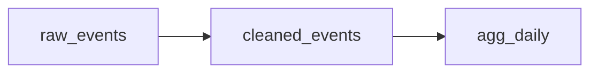
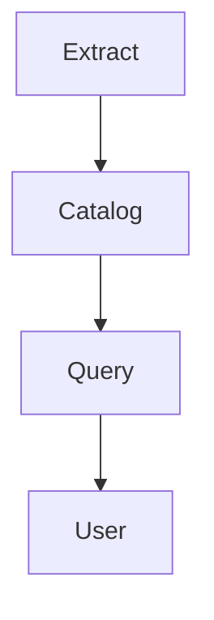

# Data Catalogs

📄 File: `book/26_data_catalogs_governance/data_catalogs.md`

This chapter introduces **data catalogs**—centralized metadata for discoverability, lineage, and governance.

---

## Study Plan (2 days)

* Day 1: Concepts + metadata types
* Day 2: Tool comparison

---

## 1 — What is a Data Catalog?

**Data catalog** = searchable metadata registry for datasets, tables, and columns.



---

## 2 — Metadata Types

| Type | Description | Example |
|------|-------------|---------|
| Technical | Schema, types | column: user_id, type: string |
| Operational | Freshness, size | last_updated, row_count |
| Business | Glossary, owner | definition, steward |

### Diagram — Catalog Components



---

## 3 — Metadata Model (Conceptual)

```python
from dataclasses import dataclass
from typing import Optional
from datetime import datetime

@dataclass
class TableMetadata:
    """Table metadata for catalog."""
    name: str
    database: str
    schema: str
    columns: list[dict]
    owner: Optional[str] = None
    last_updated: Optional[datetime] = None
    description: Optional[str] = None
```

---

## 4 — Lineage



* Tracks data flow: source → transform → destination
* Supports impact analysis and debugging

---

## 5 — Tool Landscape

| Tool | Focus | Lineage | OSS |
|------|-------|---------|-----|
| Amundsen | Discovery | Yes | Yes |
| DataHub | Metadata + governance | Yes | Yes |
| OpenMetadata | Unified | Yes | Yes |
| AWS Glue | AWS-native | Yes | No |

---

## Diagram — Catalog Flow



---

## Exercises

1. Design a minimal metadata schema for tables.
2. Document lineage for a 3-step pipeline.
3. Compare Amundsen vs DataHub for your use case.

---

## Interview Questions

1. What is a data catalog?
   *Answer*: Centralized metadata registry; search, lineage, ownership; discoverability.

2. Why is lineage important?
   *Answer*: Impact analysis, debugging, compliance; trace data flow.

3. Technical vs business metadata?
   *Answer*: Technical = schema, types; business = definitions, owners, glossary.

---

## Key Takeaways

* Catalog = metadata + search + lineage.
* Technical, operational, business metadata.
* Lineage for impact analysis and compliance.

---

## Next Chapter

Proceed to: **data_governance.md**
