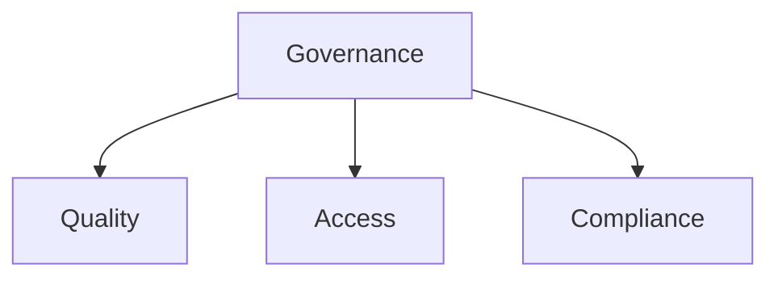
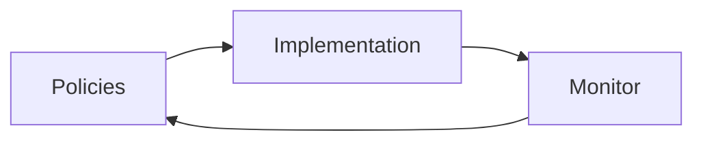
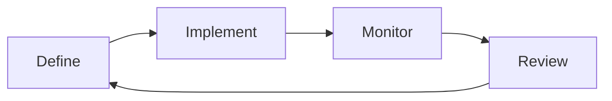

# Data Governance

📄 File: `book/26_data_catalogs_governance/data_governance.md`

This chapter covers **data governance**—policies, access control, quality, and compliance for data assets.

---

## Study Plan (2 days)

* Day 1: Principles + policies
* Day 2: Implementation + tools

---

## 1 — What is Data Governance?

**Data governance** = framework for managing data quality, access, and compliance.



---

## 2 — Governance Pillars

| Pillar | Description |
|--------|-------------|
| Quality | Accuracy, completeness, consistency |
| Access | Who can access what |
| Compliance | GDPR, SOX, HIPAA |
| Lifecycle | Retention, archival |

### Diagram — Governance Framework



---

## 3 — Access Control Model

```python
# RBAC for data: role -> permission -> resource
def check_access(user: str, resource: str, action: str) -> bool:
    """Check if user can perform action on resource."""
    roles = get_user_roles(user)
    for role in roles:
        if has_permission(role, resource, action):
            return True
    return False

# Example: user "alice" with role "analyst" can SELECT on schema "public"
```

---

## 4 — Data Quality Rules

```python
from dataclasses import dataclass
from typing import Callable

@dataclass
class QualityRule:
    """Data quality rule definition."""
    name: str
    check: Callable  # Returns True if pass
    severity: str   # "error", "warning"

def not_null(column):
    return lambda df: df[column].notna().all()

def unique(column):
    return lambda df: df[column].is_unique
```

---

## 5 — Retention Policy

```python
RETENTION_POLICY = {
    "raw_events": "90 days",
    "aggregated": "2 years",
    "pii": "30 days after deletion request",
}
```

---

## Diagram — Governance Lifecycle



---

## Exercises

1. Define access roles for a data warehouse.
2. Implement 2 quality rules (not null, range).
3. Document retention for PII vs analytics data.

---

## Interview Questions

1. What is data governance?
   *Answer*: Framework for quality, access, compliance; policies, roles, monitoring.

2. How does governance relate to catalog?
   *Answer*: Catalog provides metadata; governance adds policies, access, quality rules.

3. GDPR considerations for data governance?
   *Answer*: Right to delete, access, portability; retention limits; consent tracking.

---

## Key Takeaways

* Governance = quality + access + compliance + lifecycle.
* RBAC for access; quality rules for validation.
* Retention and compliance policies per data type.

---

## Next Chapter

Proceed to: **amundsen.md**
