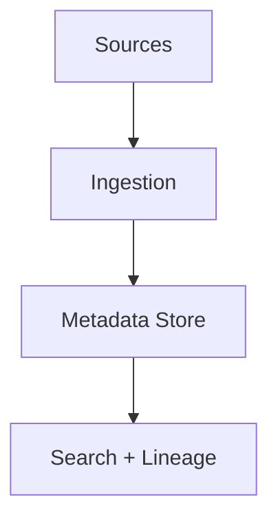
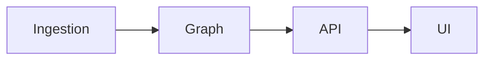

# DataHub

📄 File: `book/26_data_catalogs_governance/datahub.md`

This chapter covers **DataHub**—LinkedIn's metadata platform for discovery, lineage, and governance.

---

## Study Plan (2 days)

* Day 1: Concepts + metadata model
* Day 2: Ingestion + UI

---

## 1 — DataHub Overview



* Unified metadata; graph model
* REST + Kafka ingestion

---

## 2 — Core Concepts

| Concept | Description |
|---------|-------------|
| Entity | Dataset, dashboard, user |
| Aspect | Metadata attribute (schema, ownership) |
| Relationship | Lineage, ownership |

---

## 3 — Metadata Model (Conceptual)

```python
# DataHub uses a graph: entities + relationships
# Entity: dataset, chart, corpuser
# Aspect: schema, ownership, tags
# Example: dataset --schema--> schema_aspect
#          dataset --ownership--> corpuser
```

---

## 4 — Ingestion (CLI)

```bash
# Ingest from BigQuery
datahub ingest -c recipe_bigquery.yaml

# recipe_bigquery.yaml
# source:
#   type: bigquery
#   config:
#     project_id: my-project
# sink:
#   type: datahub-rest
#   config:
#     server: http://localhost:8080
```

---

## 5 — Python SDK

```python
from datahub.emitter.mce_builder import make_dataset_urn
from datahub.emitter.rest_emitter import DatahubRestEmitter

# Emit metadata
emitter = DatahubRestEmitter("http://localhost:8080")
urn = make_dataset_urn(platform="s3", name="bucket/path")
# Add metadata aspects...
```

---

## Diagram — DataHub Architecture



---

## Exercises

1. Ingest metadata from a database.
2. Add a tag to a dataset via API.
3. View lineage for a table.

---

## Interview Questions

1. What is DataHub's metadata model?
   *Answer*: Graph of entities (datasets, users) with aspects (schema, ownership) and relationships.

2. How does ingestion work?
   *Answer*: Plugins (sources) extract metadata; push to REST or Kafka; sink to DataHub.

3. DataHub vs Amundsen?
   *Answer*: DataHub has richer graph model, more sources, governance; Amundsen lighter, focused on discovery.

---

## Key Takeaways

* DataHub: graph metadata; entities + aspects.
* Ingestion via plugins; REST/Kafka.
* Discovery, lineage, governance, access control.

---

## Next Chapter

Proceed to: **openmetadata.md**
