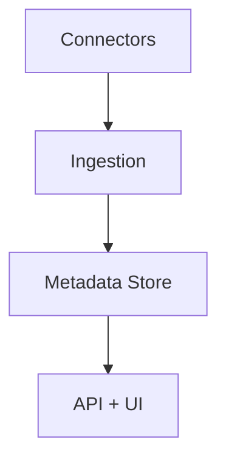
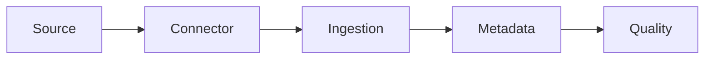

# OpenMetadata

📄 File: `book/26_data_catalogs_governance/openmetadata.md`

This chapter covers **OpenMetadata**—unified metadata platform with discovery, lineage, and governance.

---

## Study Plan (2 days)

* Day 1: Architecture + setup
* Day 2: Connectors + metadata

---

## 1 — OpenMetadata Overview



* Unified metadata; 50+ connectors
* Discovery, lineage, quality, governance

---

## 2 — Core Concepts

| Concept | Description |
|---------|-------------|
| Entity | Table, topic, dashboard |
| Service | Connection to source (DB, Kafka) |
| Pipeline | Ingestion workflow |

---

## 3 — Connector (Example)

```yaml
# Ingestion pipeline for Snowflake
source:
  type: snowflake
  serviceName: snowflake_prod
  serviceConnection:
    config:
      type: Snowflake
      ...
  sourceConfig:
    config:
      type: DatabaseMetadata
```

---

## 4 — Metadata API

```python
# OpenMetadata REST API
# GET /v1/tables/name/{fqdn}
# Get table metadata, lineage, owner
```

---

## 5 — Data Quality

```python
# OpenMetadata supports data quality tests
# Tests: table row count, column nulls, uniqueness
# Schedule tests; alert on failure
```

---

## Diagram — OpenMetadata Flow



---

## Exercises

1. Add a MySQL connector and ingest.
2. Create a data quality test.

---

## Interview Questions

1. OpenMetadata vs DataHub?
   *Answer*: Both unified; OpenMetadata has strong connector coverage, built-in quality; DataHub has graph model.

2. What is a service in OpenMetadata?
   *Answer*: Connection to a source (database, Kafka); groups related entities.

3. How does OpenMetadata handle lineage?
   *Answer*: Extracted from query logs or declared; stored in metadata; visualized in UI.

---

## Key Takeaways

* OpenMetadata: unified metadata; 50+ connectors.
* Discovery, lineage, quality, governance.
* Service = connection; pipeline = ingestion.

---

## Next Chapter

Proceed to: **27_cost_resource_management/README.md**
