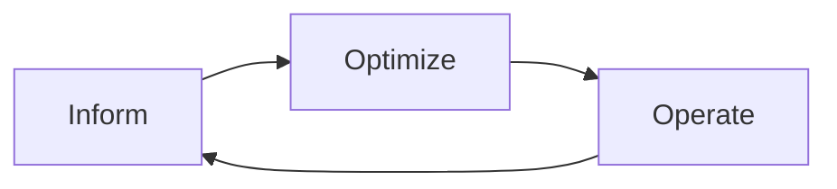
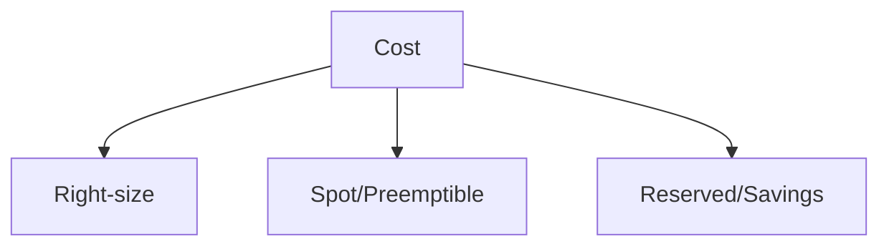
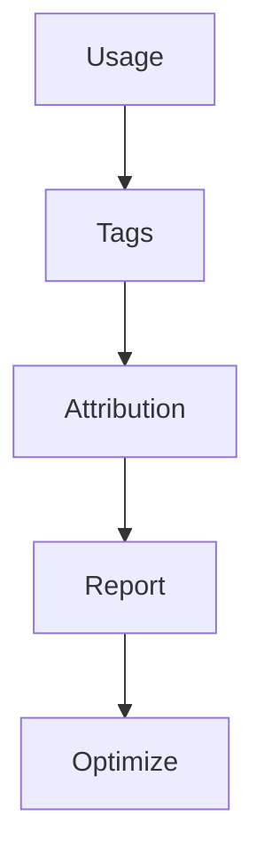

# Cost & Resource Management

📄 File: `book/27_cost_resource_management/README.md`

This chapter covers **FinOps**, resource optimization, and cost attribution for ML/AI workloads.

---

## Study Plan (2–3 days)

* Day 1: FinOps principles + cost visibility
* Day 2: Resource optimization
* Day 3: ML/AI cost attribution

---

## 1 — FinOps Overview

**FinOps** = cultural practice of cloud financial management; engineering + finance collaboration.



---

## 2 — Key Principles

| Principle | Description |
|-----------|-------------|
| Visibility | Know what you spend and where |
| Ownership | Teams own their costs |
| Optimization | Right-size, spot, reserved |

### Diagram — Cost Levers



---

## 3 — Cost Attribution for ML

```python
# Tag resources for attribution
TAGS = {
    "project": "ml-inference",
    "team": "ai-platform",
    "environment": "prod",
    "cost_center": "eng-ai",
}

# Use in Terraform/CloudFormation
# resource "aws_instance" "gpu" {
#   tags = TAGS
# }
```

---

## 4 — Resource Optimization

```python
# Right-size: match instance to workload
# - Profile CPU/memory usage
# - Downsize over-provisioned instances

# Spot/Preemptible: 60-90% savings for fault-tolerant workloads
# - Training jobs with checkpointing
# - Batch inference

# Reserved/Savings Plans: commit for 1-3 years; discount
```

---

## 5 — ML-Specific Costs

| Component | Cost Driver | Optimization |
|-----------|-------------|--------------|
| Training | GPU hours | Spot, smaller models, early stopping |
| Inference | Instance hours | Autoscaling, batch, model compression |
| Data | Storage + transfer | Lifecycle, compression, region |

---

## Diagram — Cost Pipeline



---

## Exercises

1. Add cost tags to a Terraform module.
2. Design a cost report by team and project.
3. Compare on-demand vs spot for a training job.

---

## Interview Questions

1. What is FinOps?
   *Answer*: Cloud financial management; visibility, ownership, optimization; engineering + finance.

2. How do you attribute ML costs?
   *Answer*: Tags (project, team, job); separate training vs inference; track by model version.

3. When to use spot instances for ML?
   *Answer*: Training with checkpointing; batch inference; fault-tolerant workloads; 60-90% savings.

---

## Key Takeaways

* FinOps: inform, optimize, operate.
* Tag for attribution; right-size, spot, reserved.
* ML: GPU hours, inference scaling, data storage.

---

## Next Chapter

Proceed to next phase in the handbook.
